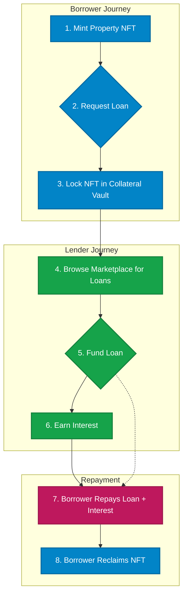
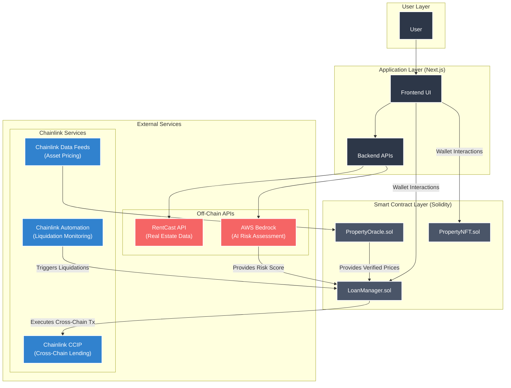

# ORACLEND - AI-Powered Private Credit Vault

A comprehensive NFT-collateralized lending platform for real-world assets (RWAs) featuring AI risk assessment, cross-chain functionality, automated liquidation monitoring, and Chainlink-powered oracles.

## 🚀 Features

### Core Lending System

- **NFT Collateral System**: Deposit property NFTs as loan collateral with Chainlink price verification
- **Complete Workflow**: End-to-end lending process from collateral deposit to loan funding
- **Multi-Asset Support**: Real estate, art, invoices, and commercial properties
- **Dynamic Interest Rates**: AI-powered risk assessment adjusts rates in real-time

### AI & Risk Management

- **AWS Bedrock Integration**: Advanced AI risk assessment using Claude-3
- **Real-time Risk Scoring**: Dynamic risk scores (0-100) with volatility tracking
- **Interest Rate Optimization**: AI adjusts rates based on market conditions and borrower profile
- **Portfolio Risk Monitoring**: Continuous health factor tracking

### Cross-Chain Functionality

- **Chainlink CCIP Integration**: Seamless cross-chain loan funding
- **Multi-Chain Liquidity Pools**: Add/withdraw liquidity across Avalanche, Polygon, Arbitrum
- **Cross-Chain Yield Farming**: Earn yields across multiple networks
- **Unified Dashboard**: Monitor positions across all supported chains

### Oracle & Data Integration

- **Chainlink Functions**: Real-time property valuation via external APIs
- **Price Feed Integration**: Live market data for multiple asset types
- **Automated Valuation Updates**: Property values updated automatically
- **Market Data Aggregation**: Comprehensive real estate market insights

### Automation & Monitoring

- **Chainlink Automation**: Automated liquidation monitoring and execution
- **Health Factor Tracking**: Real-time loan-to-value ratio monitoring
- **Warning Systems**: Multi-tier liquidation thresholds (warning, soft, hard)
- **Automated Execution**: Smart contract-based liquidation without manual intervention

### Enhanced Security

- **Multi-Signature Vaults**: Secure collateral storage with access controls
- **Oracle Security**: Chainlink's decentralized oracle network
- **Cross-Chain Security**: CCIP's secure cross-chain messaging
- **AI Risk Validation**: Multiple layers of risk assessment

## 🛠 Tech Stack

### Frontend

- **Next.js 15.3.3** with App Router
- **TypeScript** for type safety
- **Tailwind CSS** for styling
- **Wagmi v2** for Web3 integration
- **RainbowKit** for wallet connection
- **React Query** for state management

### Smart Contracts

- **Solidity 0.8.30** with latest security features
- **OpenZeppelin** for battle-tested contracts
- **Chainlink Contracts** for oracle integration
- **Custom Error Handling** for gas optimization

### Blockchain Integration

- **Ethereum Sepolia** testnet (mainnet ready)
- **Multi-Chain Support**: Avalanche, Polygon, Arbitrum
- **Chainlink CCIP** for cross-chain messaging
- **Chainlink Functions** for external API calls

### AI & External Services

- **AWS Bedrock** (Claude-3) for risk assessment
- **Chainlink Functions** for property valuation
- **Chainlink Price Feeds** for market data
- **Chainlink Automation** for monitoring

## 📋 Prerequisites

- Node.js 18+
- npm or yarn
- AWS Account (for Bedrock AI)
- MetaMask or compatible Web3 wallet
- Sepolia testnet ETH for gas fees

## ⚡ Quick Setup

### 1. Clone and Install

```bash
git clone <repository-url>
cd private-credit-vault
npm install
```

### 2. Environment Configuration

```bash
# Copy environment files
cp .env.example .env
cp frontend/.env.example frontend/.env.local
```

Required environment variables:

```bash
# AWS Bedrock (Required for AI risk assessment)
AWS_ACCESS_KEY_ID=your_aws_access_key_here
AWS_SECRET_ACCESS_KEY=your_aws_secret_key_here
AWS_REGION=us-east-1

# WalletConnect (Required for frontend)
NEXT_PUBLIC_WALLET_CONNECT_PROJECT_ID=your_wallet_connect_project_id

# Optional: Enhanced market insights
PERPLEXITY_API_KEY=your_perplexity_api_key_here
```

### 3. AWS Bedrock Setup

1. Create an AWS account and enable Bedrock access
2. Request access to Claude-3 models in your AWS region
3. Create IAM user with Bedrock permissions:

```json
{
  "Version": "2012-10-17",
  "Statement": [
    {
      "Effect": "Allow",
      "Action": ["bedrock:InvokeModel", "bedrock:ListFoundationModels"],
      "Resource": "*"
    }
  ]
}
```

### 4. Deploy Smart Contracts

```bash
# Deploy to Sepolia testnet
npx hardhat run scripts/DeployScript.ts --network sepolia
```

### 5. Start the Application

```bash
# Start frontend
cd frontend
npm run dev

# Start backend (if needed)
cd ..
npm run dev
```

The application will be available at `http://localhost:3000`

## Smart Contract Architecture

### Core Contracts

- **PropertyNFT**: ERC721 tokens representing real-world properties
- **CollateralVault**: Secure storage for NFT collateral with oracle integration
- **LoanManager**: Core lending logic with AI integration and cross-chain support
- **LenderNFT**: ERC721 tokens representing lender positions
- **PropertyOracle**: Chainlink Functions integration for property valuation
- **AIRiskManager**: AWS Bedrock integration for AI risk assessment

### Cross-Chain Contracts

- **CrossChainLiquidityPool**: Manages liquidity across multiple chains
- **CCIP Integration**: Secure cross-chain messaging and token transfers

### Key Features

- **Custom Error Handling**: Gas-optimized error messages
- **Access Control**: Role-based permissions for security
- **Event Logging**: Comprehensive event tracking for transparency
- **Upgradeable Design**: Modular architecture for future enhancements

## Platform Workflow

The ORACLEND platform facilitates a seamless peer-to-peer lending market for tokenized real-world assets. The diagram below illustrates the core user journeys for both Borrowers and Lenders.



### For Borrowers

1.  **Mint Property NFT**: A user tokenizes their real-world asset (e.g., a house) by minting it as an NFT on the platform.
2.  **Request a Loan**: The NFT owner initiates a loan request, specifying the amount of USDC they wish to borrow against their asset.
3.  **Collateral is Locked**: Upon request, the Property NFT is automatically transferred into a secure `CollateralVault` smart contract, where it remains locked until the loan is repaid. The loan is now listed on the marketplace for lenders to fund.

### For Lenders

1.  **Browse Marketplace**: Lenders can view all active, unfunded loan requests on the marketplace. Each listing includes the property details, AI-driven risk score, and the interest rate (APR) they will earn.
2.  **Fund Loan**: A lender provides the requested USDC to fund the loan. This is done via a cross-chain transaction using Chainlink CCIP.
3.  **Earn Interest**: In return for funding the loan, the lender receives a LenderNFT (an interest-bearing token) and begins earning the specified yield.

### Loan Repayment & Liquidation

- **Repayment**: The borrower repays the USDC loan plus the accrued interest. Once fully repaid, their original Property NFT is returned from the vault, and the LenderNFT is burned.
- **Liquidation**: If the borrower fails to repay or if their loan's health factor drops below the liquidation threshold (due to changes in collateral value), the system allows the lender to liquidate the position and claim the underlying Property NFT.

## Advanced Features

### AI Risk Management

- **Real-time Scoring**: Dynamic risk assessment every hour
- **Multi-Factor Analysis**: Property type, location, market conditions
- **Interest Rate Adjustment**: AI-optimized rates based on risk
- **Volatility Tracking**: Market volatility impact on risk scores

### Cross-Chain Liquidity

- **Multi-Chain Support**: Avalanche, Polygon, Arbitrum, Ethereum
- **Liquidity Pools**: Add/withdraw liquidity across chains
- **Yield Optimization**: Earn yields from multiple networks
- **Risk Diversification**: Spread risk across different chains

### Property Valuation

- **Chainlink Functions**: Real-time property valuation
- **Market Data Integration**: Live real estate market data
- **Automated Updates**: Property values updated automatically
- **Multi-Source Validation**: Multiple data sources for accuracy

### Automated Monitoring

- **Health Factor Tracking**: Real-time LTV ratio monitoring
- **Warning Systems**: Multi-tier liquidation alerts
- **Automated Execution**: Smart contract-based liquidation
- **Performance Metrics**: Comprehensive monitoring dashboard

## Demo Mode

The platform includes comprehensive demo data:

- **Sample NFTs**: Property NFTs with realistic valuations
- **Mock Loans**: Various loan scenarios with different risk levels
- **AI Simulations**: Simulated AI risk assessments
- **Cross-Chain Demo**: Test cross-chain functionality
- **Liquidation Scenarios**: Test automated liquidation monitoring

## Security Features

### Smart Contract Security

- **Audited Libraries**: OpenZeppelin battle-tested contracts
- **Custom Error Handling**: Gas-optimized and secure error messages
- **Access Control**: Role-based permissions and ownership controls
- **Reentrancy Protection**: Secure against reentrancy attacks

### Oracle Security

- **Chainlink Network**: Decentralized oracle network
- **Multi-Source Validation**: Multiple data sources for accuracy
- **Automation Security**: Secure automated execution
- **Cross-Chain Security**: CCIP's secure messaging protocol

### AI Security

- **AWS Bedrock**: Enterprise-grade AI security
- **Data Privacy**: Secure handling of sensitive data
- **Risk Validation**: Multiple layers of risk assessment
- **Audit Trails**: Comprehensive logging and monitoring

## Architecture



## Production Deployment

### Environment Setup

```

```
