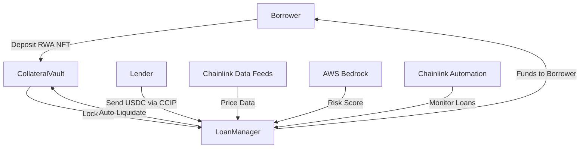

# AI-Powered Private Credit Vault  
**Onchain private credit with AI risk scoring, cross-chain loans, and auto-liquidation.**  
Built with Chainlink (CCIP, Automation, Data Feeds), AWS Bedrock (AI), and Solidity.  

## **Hackathon Fit**  
- **Chainlink Grand Prize**: Uses CCIP + Automation + Data Feeds.  
- **Sponsor Tech**: AWS Bedrock for AI risk modeling.  
- **Prize Tracks**: Best RWA + Best DeFi.  

## **How It Works**  
1. **Borrowers** deposit RWAs (real estate NFTs, invoices) as collateral.  
2. **Lenders** fund loans cross-chain (via CCIP).  
3. **AI Model** (AWS Bedrock) adjusts interest rates based on risk.  
4. **Chainlink Automation** liquidates collateral if value drops.  

## **Tech Stack**  
- **Smart Contracts**: Solidity (Ethereum + Avalanche).  
- **Oracles**: Chainlink Data Feeds (collateral pricing), CCIP (cross-chain), Automation (liquidations).  
- **AI**: AWS Bedrock (default prediction), Lambda (trigger Automation).  
- **Frontend**: Next.js + Ethers.js.  

## **Repo Structure**  
/contracts # Solidity (LoanManager, CollateralVault)
/scripts # Deployment + Automation scripts
/frontend # Next.js app
/aws # AI model + Lambda code

---

# **System Architecture**  
